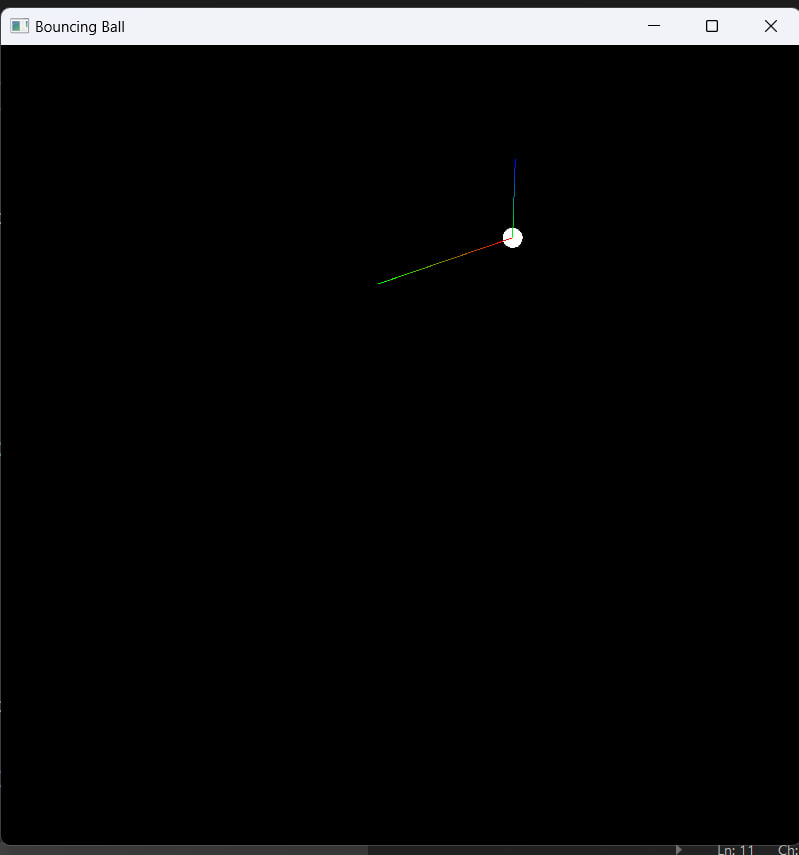

[](https://www.nuget.org/packages/Krane)
[](https://www.gnu.org/licenses/gpl-3.0.txt)

# Krane

Krane is a graphics framework for [C#](https://g.co/kgs/vxLHKK) built on top of [SFML.NET](https://github.com/SFML/SFML.Net)
It allows for fast and reliable graphics rendering.
## Dependencies
- [SFML.NET](https://github.com/SFML/SFML.Net)
## Installation

```powershell
dotnet add package Krane
```

## Usage

### Bouncing Ball example

```csharp
using Krane;
using Krane.Core;
using Krane.Extensions;
using Krane.GUI;
using Krane.GUI.Widgets;
using SFML.Graphics;
using SFML.System;
using SFML.Window;

using (var sim = new Simulation())
{
    sim.Start();
}

public class Simulation : Game
{
    public CircleShape ball;
    public Vector2f vel;
    public Simulation() : base((800,800), "Bouncing Ball")
    {
        SetTitle("Bouncing Ball");
        ball = new(10f);
        ball.CenterOrigin();
        ball.SetPosition(WIDTH / 2, HEIGHT / 2);
    }
    public override void Initialize()
    {
    }

    public override void Update()
    {
        vel += new Vector2f(0, 10f) * GameTime.DeltaTime.AsSeconds();
        if (ball.Position.Y >= HEIGHT - ball.Radius || ball.Position.Y <= ball.Radius)
        {
            vel.Y *= -1f;
        }
        if (ball.Position.X <= ball.Radius || ball.Position.X >= WIDTH - ball.Radius)
        {
            vel.X *= -1f;
        }
        if (Input.IsMouseDown(Mouse.Button.Left))
        {
            vel += (Input.MousePos - ball.Position).Normalize();
        }
        ball.Position += vel *= (99 / 100f);
        ball.Position = ball.Position.Clamp(new(ball.Radius, ball.Radius), new(WIDTH - ball.Radius, HEIGHT - ball.Radius));
    }

    public override void Draw()
    {
        Render.Clear();
        Render.Draw(ball);
        if (Input.IsMouseDown(Mouse.Button.Left))
        {
            var forceLine = new LineShape(ball.Position, Input.MousePos, startColor: Color.Green, endColor: Color.Red);
            Render.Draw(forceLine);
        }
        var velLine = new LineShape(ball.Position, ball.Position + vel * 5f, startColor: Color.Blue, endColor: Color.Green);
        Render.Draw(velLine);
    }
}
```
## Roadmap
### GUI
- Revamp GUI System
- Replace with ImGui
### New Features
- Cameras
- 2D Physics
- Collision Detection

## Contributing
Pull requests are welcome. For major changes, please open an issue first to discuss what you would like to change.

Please make sure to update tests as appropriate.

## License
[GNU General Public License v3.0](https://www.gnu.org/licenses/gpl-3.0.txt)
